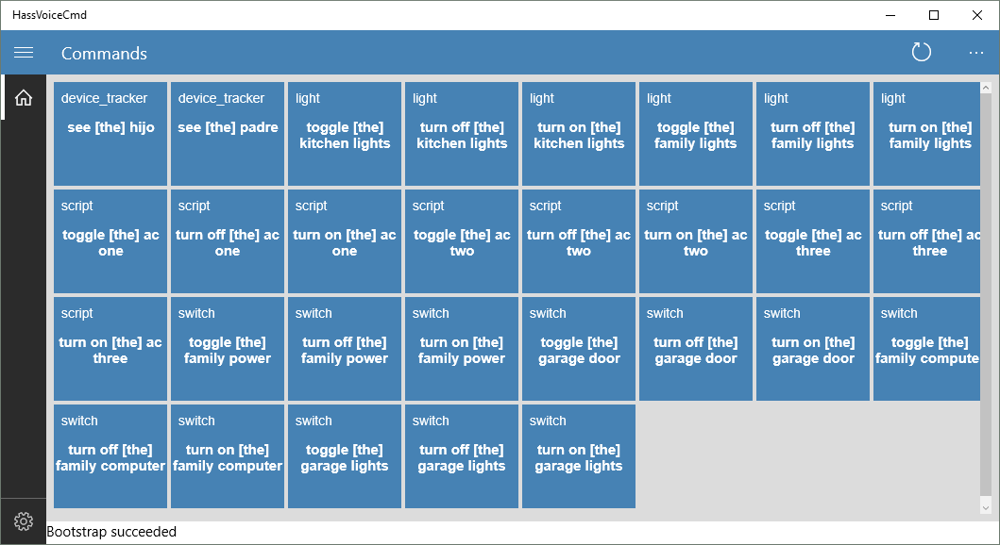

##HassVoiceCmd

This is an Universal Windows Platform (UWP) application that bootstraps <a href="http://Home-Assistant.io">http://Home-Assistant.io</a> and registers each service/entity as custom Cortana commands.

##Requirements

This application was built with Microsoft Visual Studio 2015 Community Edition (https://www.visualstudio.com/vs/community) 
Using Template10 (https://github.com/Windows-XAML/Template10)
It requires Newtonsoft.Json (http://www.newtonsoft.com/json">http://www.newtonsoft.com/json)

##How it works

You can run the application within Visual Studio, after launched. 
Click Settings, enter your Home-assistant web address, a prefix for cortana and entities you want filtered out. 
Click Home. 
After bootstraping, it display a list of all the available commands.
To call a command, just speak the prefix together with the phrase as shown in the UI. 
For example: "Please turn on the garage light".
